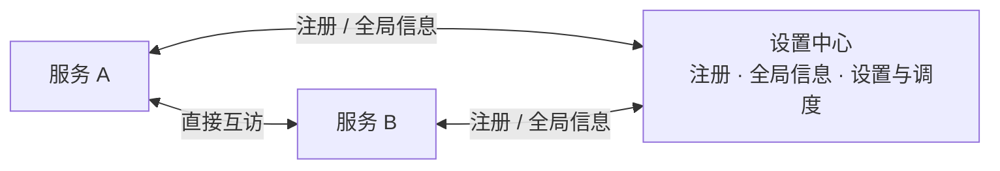
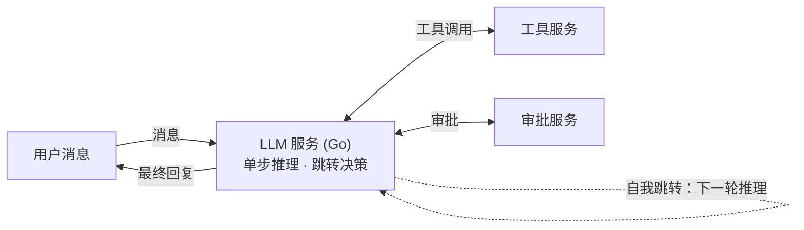

# SUMP v2 · 重构设计

> 状态：草稿（填写中）
> 来源：`../1`（SUMP v0.2.0 实现，参考 `docs/SUMP_architecture.md`）
> 目标：本目录（`2`）

---

## 1. 背景：1 走了哪些弯路

- **根本架构问题**：1 从根本架构上就有问题，导致严重竞态（具体场景待补充）。
- **v2 对策**：服务之间彻底隔离——独立进程、独立运行、独立数据库，用网络通信取代进程内共享状态。

## 2. 设计目标与非目标

**核心理念：模仿互联网。** 一句话：v2 是一个“服务的互联网”——服务之间不共享任何进程内状态，只在网络上互相访问。

- **服务互相独立、互相访问**：每个服务是独立进程，有自己的地址，可以被其他服务按地址访问。
- **WebSocket 通信**：服务之间的一切往来都通过 WS 消息传递。
- **语言不统一**：各服务自由选择语言——当前分配（性能优先）：Go 扛全部逻辑，embedding 用 Python，前端 TS。
- **独立数据库、独立运行**：各服务自带存储，可单独部署、单独重启。
- **智能体循环可自由组装**：循环不驻留任何服务内部，而是 LLM 服务的**自我跳转链**——每一步都可插入 / 替换 / 观察。

**非目标**：（待补充）

## 3. 总体架构

### 互联网类比

| 互联网 | SUMP v2 |
| ------ | ------- |
| 网站 | 服务（独立进程 / 独立数据库 / 任意语言） |
| 网址 | 服务地址（`ws://host:port/...`） |
| 浏览器 + 网址栏 | LLM 服务发起的一次“访问” |
| 网页间跳转 | 智能体循环的每一步 |
| 网民 | LLM 服务（决定下一个访问哪里） |

### 设置中心（注册 · 全局信息 · 设置与调度）

- **服务注册**：各服务访问设置中心并发送报文，内容包括：自己的位置（地址）、可设置项、功能简介、接受什么输入、有什么输出。
- **全局信息分发（类似 DNS）**：
  - **推送**：有新服务注册时，设置中心向所有服务推送最新**全量**清单（`roster` 事件）；
  - **拉取**：服务可随时访问设置中心获取最新全量清单（`jump` 的 `roster` 动作）——推送丢失 / 服务重启后的自愈手段。
- **设置与调度**：各服务接受设置中心的设置与调度。调度**不是中央交换机**，而是“设置各个服务的行为、设计工作流”。
- 服务间的实际访问**不经设置中心中转**。



### 智能体循环：自我跳转

**循环不实现在任何服务内部**，而是网络上的跳转链：每一步都是独立的消息处理（收到输入 → 处理 → 发出下一步），不驻留进程内的循环状态；跨步状态显式化（随消息或会话存储携带）。

- LLM 服务是**单步推理器**：收到一次输入，调一次 LLM，产出“下一步动作”
- **“继续推理” = LLM 服务对自己的跳转**——与其他跳转完全同构
- 下一步动作：访问工具服务 / 重新访问自己 / 访问审批 / 生成最终回复



### 通信与性能约定

- 服务间 WS **不做纯长连接**：默认短连接、空闲即断；访问频繁则连接保留时长上涨，冷下来回落——随实际访问频率自适应增减。
- **连接时长可配置**：每个服务可自定义自己的默认连接时长（可作为“可设置项”，由设置中心统一下发）。
- **流式直通**：LLM token 流从 agentloop 一路透传到 QQ / 浏览器，中间不攒批。
- **并行跳转**：一轮内多个跳转并行发出（goroutine），汇合后继续推理。

### 协议格式

**序列化：MessagePack 为主，JSON 保留作调试开关。**

| 方案 | 性能 | 可读性 | 开发负担 | 取舍 |
| ---- | ---- | ------ | -------- | ---- |
| JSON | 基准 | ✅ | 最低 | 调试模式（文本帧） |
| **MessagePack** | 体积小 30–50%、解析快 2–5× | ❌（需工具解码） | 低（与 JSON 同构，无 IDL） | **主选** |
| protobuf / FlatBuffers | 最快之一 | ❌ | 高（schema + 代码生成） | 不选 |
| 自研二进制 | 理论最优 | ❌ | 最高 | 不选 |

- 不选 protobuf 的原因：agent 消息形态多变，强 schema 维护成本大于收益；未来瓶颈链路可单独换格式。
- 落地库：Go `vmihailenco/msgpack`（或 `msgp`）；Python `msgspec`（同库支持 MessagePack + JSON）；TS `msgpackr`。

**帧分层**

- 控制消息 → 二进制帧（MessagePack）；调试模式 → 文本帧（JSON）。
- 大二进制（图片 / 音频）→ 独立二进制帧，不塞进控制消息；超大走分帧。
- LLM token 流 → 专用流帧直通，不套信封。

**信封**（所有控制消息一层壳）

```jsonc
{
  "v": 1,                        // 协议版本
  "id": "01J...",                // 消息 id（请求 → 响应配对）
  "trace": "01J...",             // 链路 id（同一条用户请求的全链共享）
  "type": "register",            // 消息类型 = 动作（register / jump / ...）
  "from": "agentloop",
  "to": "settings-center",
  "payload": { }                 // 该动作的数据
}
```

#### 消息类型（第一批）

> 信封统一 `v / id / trace / type / from / to / payload`；以下只列 `type` 与 `payload`。

**① `register`**（服务 → 设置中心，请求）——启动即注册：

```jsonc
{
  "v": 1, "id": "01J...", "trace": "01J...", "type": "register",
  "from": "agentloop", "to": "settings-center",
  "payload": {
    "name": "agentloop",
    "addr": "ws://127.0.0.1:9101/ws",        // 自己的位置
    "description": "LLM 单步推理：决定下一步跳转（工具 / 自己 / 审批 / 回复）",
    "provides": [                             // 接受什么输入、有什么输出
      { "action": "user_message", "input": "用户消息（文本/图片）", "output": "流式回复" }
    ],
    "settings": [                             // 可设置项
      { "key": "conn.default_ttl", "default": "5m" }
    ]
  }
}
```

**② `response`**（通用，所有请求的回复）——`id` 与请求配对：

```jsonc
{
  "type": "response",
  "payload": { "ok": true, "data": { "roster": [ /* 当前全局清单 */ ], "revision": 3 }, "error": null }
}
```

**③ `roster`**（设置中心 → 各服务，事件）——全局信息分发：

```jsonc
{
  "type": "roster",
  "payload": { "services": [ /* 各服务名片的公开部分 */ ], "revision": 4 }
}
```

**④ `jump`**（任意服务 → 任意服务，请求）——唯一的“访问”动作（用户消息、工具调用都是 jump）：

```jsonc
{
  "type": "jump",
  "payload": { "action": "shell_exec", "input": { "command": "ls -la" } }
}
```

**⑤ `heartbeat`**（服务 → 设置中心，事件）——报活：

```jsonc
{ "type": "heartbeat", "payload": { "status": "ok" } }
```

**已定约束**

- 引导只靠配置：设置中心地址 + 自己的名字/地址；其余全靠 `register` 响应与 `roster`（这是“地址发现”的全部）
- `register` 响应直接带当前全局 roster，新服务立刻可互访
- action 命名在服务内唯一（`to` 已指明服务），无需全局前缀
- `provides` 的 input/output 用宽松描述，不做正式 JSON Schema
- `jump` 的目标**可以是自己**：LLM 每一轮推理 = 一次自我跳转（循环的下一次）
- 信封 `trace`：同一条用户请求的全链共享（用户消息 → N 次自跳 → 工具 → 回复），调试 / 审计靠它
- 流式回复：专用流帧带关联 id 推回，`response` 收尾
- 心跳默认 15s；离线判定 = 2 倍间隔超时，设置中心更新 roster 推送（无专门离线消息）
- 拉取全量清单复用 `jump`（`action: "roster"`），不新增消息类型

**后续批次（占名）**

- `approval_request` / `approval_result`（agentloop ↔ qq/web）：审批挂起与裁决
- `configure`（设置中心 → 服务）：下发设置变更；“调度 = 设置行为、设计工作流”的消息形态待设计

### 服务清单（草案 · 语言已定）

> 从 1 的模块映射出的候选服务。**语言（性能优先）**：Go 扛全部逻辑，embedding 拆出用 Python，浏览器必须 TS。服务取舍仍在收尾。

| 候选服务 | 语言 | 职责 | 来自 1 的模块 | 备注 |
| -------- | ---- | ---- | ------------- | ---- |
| **agentloop** | Go | LLM 单步推理与跳转决策（循环 = 自我跳转链） | `agent.py`、`core/`（planner/executor）、`core/models/`、`evaluation/` | **第一批** |
| **settings-center**（设置中心） | Go | 服务注册 · 全局信息 · 设置 · 调度/工作流 | `settings.py`、`config.py` | **第一批** |
| sessions（会话） | Go | 会话历史与上下文持久化 | `api/session_manager.py`、`core/context.py` | 与接入服务的边界待定 |
| memory（记忆） | Go | 四层记忆、检索、睡眠巩固、遗忘/冲突 | `memory/`（除 embedder）、记忆巩固工具、`core/sleep.py` | |
| embedding（推理） | Python | 文本 → 向量（ONNX Runtime） | `memory/embedder.py` | 从 memory 拆出的独立小服务 |
| security（安全审批） | Go | 规则 + LLM 分析 + 裁决；挂起/超时 | `security/` | |
| tools（工具） | Go | 工具注册与执行（Shell 等） | `tools/registry.py`、`tools/builtin/` | 是否按类再拆待定 |
| qq（QQ 接入） | Go | NapCat 对接、群聊、图片、审批推送 | `plugins/builtin/napcat_plugin.py` | NapCat 容器已在 |
| web（Web 接入） | Go | 浏览器 REST/SSE 接入（不带前端） | `api/` | UI 归 frontend 服务 |
| frontend（前端服务） | TS | 浏览器 UI，独立服务节点 | `frontend/` | **后续批次**；当前所有服务不带前端 |
| assets（资产） | Go | 文件资产库、索引、检索 | `assets.py` | |
| skills（技能） | 并入 agentloop | 技能创建 / 加载 | `skills/` | |
| smart-home（智能家居） | Go | 家居控制后端 | `smart_home/` | 或并入 tools |
| search（搜索） | 无服务 | 搜索接入 | `tools/mcp/` + searxng | searxng 已是独立容器 |

> 决策注记：全 Go 的理由——并发模型 / 内存 / 长连接吞吐全面占优；v1 横竖要重写，无搬运成本优势。embedding 保留 Python 因 ONNX 生态（与 Rust 同引擎、速度等效）。

### 项目结构（目录约定）

- **一个文件夹 = 一个服务**：每个服务独立成文件夹。
- 每个服务**自带 `tests/`**：服务自身的测试跟着服务走。
- 根目录有**总 `tests/`**：跨服务的集成/端到端测试——拉起相关服务、走真实 WS 通信，验证“服务隔离 + 网络互访”（例：设置中心离线时，其余服务照常工作）。

```text
2/
├── <服务1>/         # 一个文件夹 = 一个服务
│   └── tests/       # 服务自带测试
├── <服务2>/
│   └── tests/
└── tests/           # 总测试（跨服务）
```

## 4. 数据与存储

- 各服务**独立建数据库**，数据归属到服务自身；服务之间不共享库表。
- （细化待定：每个服务存什么、跨服务数据如何流转）

## 5. 从 1 的取舍清单

<!-- 逐模块过一遍 1 的实现，确定去向；填表时机：服务清单确定后 -->

| 模块 | 保留 | 重写 | 丢弃 | 理由 |
| ---- | ---- | ---- | ---- | ---- |
|      |      |      |      |      |

## 6. 实施路线

- **第一批**：agentloop + 设置中心（纯后端，不带前端）

## 7. 待决问题

- 跳转的超时与失败、连接保活的自适应阈值与公式（“具体再看”）。
- 服务清单收尾：sessions 边界、tools 是否再拆。
