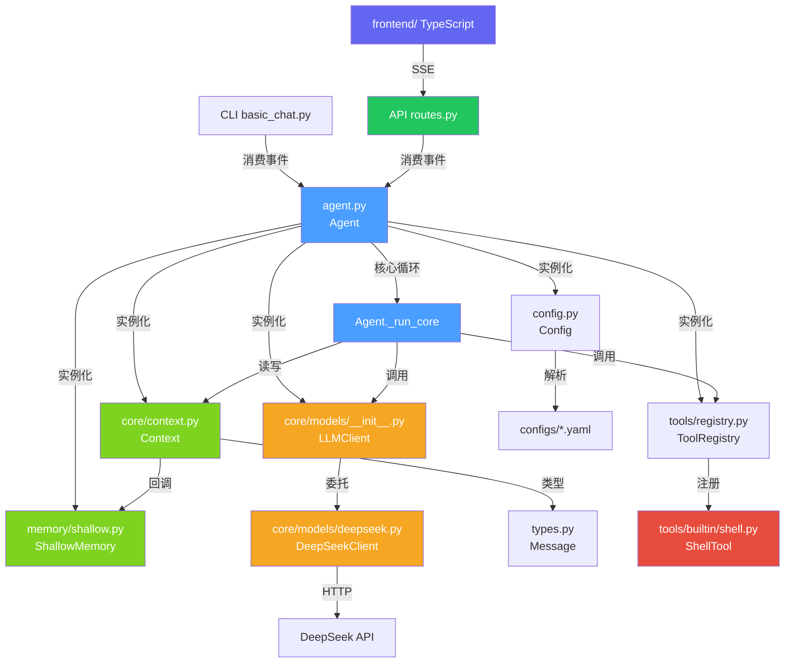

# SUMP 函数调用关系图

> 版本: v0.1.5 | 更新: 2026-08-10

---

## 总览：主对话链路

```
用户输入
  │
  ▼
Agent.run_stream(user_input)         ← 唯一入口（CLI/API 共用）
  └─ Context.add_user_message()      ← 记录用户消息（自动持久化）
  └─ Agent._run_core()               ← 核心循环
       └─ for _ in range(10):        ← 工具调用循环（round 0 始终带 tools）
            ├─ LLMClient.chat_full(history, tools=schemas)
            │    └─ DeepSeekClient.chat() → DeepSeek API
            ├─ if tool_calls:
            │    ├─ yield {"type":"tool_call", ...}
            │    ├─ Judge.analyze()           ← 规则匹配（秒出）
            │    ├─ Judge.analyze_llm()       ← LLM Flash 分析
            │    ├─ yield {"type":"security_check", ...}  ← 推送审批事件
            │    ├─ Interceptor.check()       ← 终裁
            │    ├─ if CLI: 同步审批 → 执行/拒绝
            │    └─ if API: 挂起 → yield → 等 /api/tools/approve
            │         └─ Agent.approve_command() → 执行 → 替换⛔待确认
            └─ else:
                 └─ LLMClient.chat_stream(history)
                      └─ yield {"type":"reasoning"|"content", ...}  → 流式输出

__continue__ 流程（审批后自动延续）:
  POST /api/chat/{id} {"message":"__continue__"}
    └─ Agent._is_continue=True → Agent._run_core()
         └─ 工具调用循环（同上），LLM 可链式调工具

CLI (examples/basic_chat.py):  消费事件 → ANSI 终端渲染
API (src/api/routes.py):       消费事件 → SSE 序列化
```

## 模块间调用关系



## 前端架构 (TypeScript)

```
Vite + TypeScript SPA (src/frontend/)
  ├─ index.html                     ← 入口（AI-Native UI / 浅色主题）
  ├─ src/api.ts                     ← REST + SSE 客户端
  │    ├─ Session CRUD              ← /api/sessions/*
  │    ├─ MemorySession CRUD        ← /api/memory/sessions/*
  │    └─ streamChat()              ← SSE 流式解析
  ├─ src/main.ts                    ← 主逻辑
  │    ├─ 会话管理（新建/切换/删除/重命名）
  │    ├─ 设置面板（模型/深度思考/思考强度/自动展开思考内容）
  │    ├─ 流式聊天（marked + highlight.js 渲染）
  │    ├─ 深度思考指示条（可展开推理内容，自动追踪+暂停指示点）
  │    ├─ 工具调用展示（tool_call / tool_result 终端暗色风格）
  │    └─ 安全审查内嵌展示（security-info 卡片：命令/危险等级/作用）
  └─ src/style.css                  ← 设计系统（DeepSeek 风格 / 居中布局 / 悬浮输入框）
```

### SSE 事件类型（前端消费）

| type | 前端展示 |
|------|----------|
| `tool_call` | ⚙ 调用工具 `name` {args}（淡紫背景圆角框） |
| `tool_result` | 暗色终端风格（#1E1E1E 黑底等宽字体） |
| `security_check` | 安全审查指示 / 审批弹窗（safe=🟢 命令确认, risky=🔴 危险确认） |
| `security_check_detail` | 内嵌 security-info 卡片（命令/危险等级/作用 格式化） |
| `session_name` | 侧边栏 + 标题栏会话名更新 |
| `reasoning` | 深度思考指示条（可展开，自动追踪 + 暂停指示点） |
| `content` | Markdown 渲染 + 语法高亮 |
| `continue` | 审批完成继续对话指示 |
| `error` | 红色错误提示 |
| `[DONE]` | 流结束 |

## 逐文件详解

### 1. `agent.py` — Agent（唯一业务层）

| 方法 | 调用 | 被谁调用 |
|------|------|----------|
| `__init__(config?)` | Config → Context → LLMClient → ToolRegistry → ShallowMemory → `_load_session()` | 外部实例化 |
| `run_stream(user_input)` | `ctx.add_user_message()` → `_run_core()` → yield event | CLI / API |
| `_run_core()` | `chat_full()` → Judge.analyze() → Judge.analyze_llm() → Interceptor.check() → 工具执行/挂起 → `chat_stream()` → yield event | run_stream, __continue__ |
| `approve_command(id, approved)` | `_pending_approvals` → 执行/拒绝 → 替换⛔待确认 | API tools/approve |
| `switch_session(id)` | `ctx.messages.clear()` → `_load_session()` | API memory 路由 |
| `new_session()` | `uuid4().hex` → `switch_session()` | API memory 路由 |

---

### 2. `core/planner.py` — Planner（预留）

> 当前核心循环已内联至 `Agent._run_core()`，Planner 待后续接入复杂任务拆解。

### 3. `core/executor.py` — Executor（预留）

> 工具执行逻辑已内联至 `Agent._run_core()`，Executor 待后续接入调度执行。

### 2. `config.py` — Config

| 方法 | 调用 | 被谁调用 |
|------|------|----------|
| `__init__()` | `os.getenv()` → `_load()` | Agent, LLMClient, DeepSeekClient |
| `_load()` | `yaml.safe_load()` → `_deep_merge()` | `__init__` |
| `_deep_merge()` | 递归自身 | `_load` |
| `get(key, default)` | 纯字典遍历 | DeepSeekClient (6 次) |

---

### 3. `core/context.py` — Context

| 方法 | 调用 | 被谁调用 |
|------|------|----------|
| `add_user_message()` | `Message(role="user")` → `append()` | Agent.run |
| `add_assistant_message()` | `Message(role="assistant")` → `append()` | Executor.execute |
| `history` (property) | `messages[-50:]` 切片 | Executor.execute |

---

### 4. `core/planner.py` — Planner

| 方法 | 调用 | 被谁调用 |
|------|------|----------|
| `async plan()` | 当前存根 → `[{"action": "respond"}]` | Agent.run |

> 未来接入 LLM 做复杂任务拆解

---

### 5. `core/executor.py` — Executor

| 方法 | 调用 | 被谁调用 |
|------|------|----------|
| `async execute(plan)` | 有工具 → `_run_with_tools()`；无工具 → `_stream_respond()` | Agent.run |
| `async _run_with_tools()` | `llm.chat_full(history, tools)` → 执行工具 → `ctx.add_tool_message()` → 循环 → `_stream_respond()` | execute |
| `async _stream_respond()` | `llm.chat_stream(history)` → 终端实时打印 | execute, _run_with_tools |

---

### 6. `core/models/__init__.py` — LLMClient

| 方法 | 调用 | 被谁调用 |
|------|------|----------|
| `async chat(messages)` | `DeepSeekClient.chat_text()` | 兼容旧调用 |
| `async chat_full(messages, tools?)` | `DeepSeekClient.chat()` | 预留（工具调用入口） |
| `chat_stream(messages)` | `DeepSeekClient.chat_stream()` | Executor._stream_respond |

---

### 7. `core/models/deepseek.py` — DeepSeekClient

| 方法 | 调用 | 被谁调用 |
|------|------|----------|
| `__init__(config)` | `config.get()` ×6, `os.getenv()`, `AsyncOpenAI()` | LLMClient |
| `async chat()` | `client.chat.completions.create()` → `_serialize_tool_calls()` | LLMClient.chat_full |
| `async chat_text()` | `self.chat()` | LLMClient.chat |
| `async chat_stream()` | `client.chat.completions.create(stream=True)` → 逐 chunk yield | LLMClient.chat_stream |
| `async chat_text()` | `self.chat()` → `result["content"]` | LLMClient.chat |
| `_serialize_tool_calls()` | 静态工具序列化 | chat |

---

### 8. 记忆系统（memory/）

| 类 | 状态 | 核心方法 |
|----|------|----------|
| `MemoryProvider` (ABC) | ✅ | `store / retrieve / forget / clear` |
| `WorkingMemory` | ✅ | LRU + OrderedDict 实现 |
| `ShallowMemory` | ✅ | SQLite 完整实现（save/load/list/delete/upsert_session_name/update_tool_message） |
| `DeepMemory` | ⚠️ 桩 | 向量检索接口预留 |
| `TaskMemory` | ✅ | 会话级 + scratchpad 便签 |
| `SoulLoader` | ✅ | SOUL.md 文件加载 |
| `MemoryCompressor` | ⚠️ 桩 | Working → Shallow 压缩 |

> 会话持久化已接入主链路：每条消息通过 `Context.on_message` 回调自动写入 SQLite，启动时自动恢复。reasoning_content 列支持思考内容持久化。sessions 表维护会话名，审批后通过 update_tool_message 替换待确认文本。

---

### 9. 工具系统（tools/）

| 类 | 状态 | 说明 |
|----|------|------|
| `Tool` (ABC) | ✅ | `execute()`, `to_openai_schema()` |
| `ToolRegistry` | ✅ | 注册/获取/列出/schema 导出 |
| `ToolSet` | ✅ | 按名启用/禁用 |
| `DateTimeTool` | ⚠️ 桩 | 内置日期工具 |
| `FileTool` | ⚠️ 桩 | 内置文件工具 |
| `SearchTool` | ⚠️ 桩 | 内置搜索工具 |
| `ShellTool` | ✅ | `subprocess` 执行，GBK 编码适配 |
| `WebTool` | ⚠️ 桩 | 内置 Web 工具 |
| `tools/mcp/client.py` | ⚠️ 桩 | MCP 客户端 |
| `tools/mcp/sandbox.py` | ⚠️ 桩 | MCP 沙箱 |

---

### 10. 技能系统（skills/）

| 类 | 状态 | 说明 |
|----|------|------|
| `Skill` (ABC) | ✅ | `execute()`, `to_prompt()` |
| `SkillManager` | ✅ | 注册/获取/列出/卸载 |
| `SkillCreator` | ⚠️ 桩 | 从任务自动提炼技能 |

---

### 11. 安全系统（security/）

| 类 | 状态 | 说明 |
|----|------|------|
| `Judge` | ✅ | 规则匹配 + LLM Flash 双重分析，产出 Verdict |
| `Interceptor` | ✅ | 依据 Verdict 终裁，产出 SecurityEvent 推送前端 |
| `Scanner` | ⚠️ 桩 | 未实现 |
| `rules/blacklist.yaml` | ✅ | 高危命令黑名单（rm/del/format/shutdown 等） |
| `rules/whitelist.yaml` | ✅ | 安全命令白名单（dir/ls/echo/type 等） |

> 审批流：Judge.analyze()（规则秒出）→ Judge.analyze_llm()（LLM Flash）→ Interceptor.check() 终裁 → SecurityEvent 推送前端 → 用户审批 → approve_command 执行/拒绝。审批后通过 update_tool_message 持久化替换待确认文本，刷新不丢失。API 模式下 safe/risky 统一走挂起审批，消除竞态。

---

### 12. 评估系统（evaluation/）

| 类 | 状态 | 说明 |
|----|------|------|
| `Arbiter` | ⚠️ 桩 | `arbitrate()` 恒返回通过 |
| `internal.py` | ⚠️ 桩 | 内部评估 |
| `external.py` | ⚠️ 桩 | 外部反馈 |

---

### 13. 插件系统（plugins/）

| 类 | 状态 | 说明 |
|----|------|------|
| `HookSystem` | ✅ | `on()`, `emit()` 事件钩子 |
| `SUMPAPI` | ✅ | `subscribe()`, `publish()` 事件流 |

---

### 14. 调试系统（debug/）

| 类 | 状态 | 说明 |
|----|------|------|
| `setup_logger()` | ✅ | 分级日志 |
| `Tracer` | ⚠️ 桩 | span 记录，无导出 |
| `key_output.py` | ⚠️ 桩 | 关键输出 |

---

## 图例

| 标记 | 含义 |
|------|------|
| ✅ | 已实现 |
| ⚠️ 桩 | 接口就绪，核心逻辑待填充 |
| ❌ | 空文件/未开始 |
