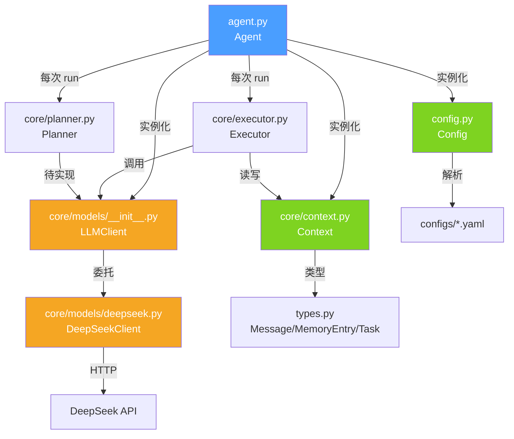

# SUMP 函数调用关系图

> 版本: v0.1.3 | 更新: 2026-08-09

---

## 总览：主对话链路

```
用户输入
  │
  ▼
Agent.chat_loop()                     ← 交互循环入口
  └─ Agent.run(user_input)
       ├─ Context.add_user_message()   ← 记录用户消息
       ├─ Planner(ctx, llm).plan()    ← 生成执行计划
       └─ Executor(ctx, llm).execute(plan)
            ├─ Context.history          ← 读取消息历史
            ├─ Executor._stream_respond()  ← 流式输出
            │    └─ LLMClient.chat_stream(history)
            │         └─ DeepSeekClient.chat_stream()
            │              └─ async for chunk → yield {"type":"reasoning"|"content","text":...}
            │                   ├─ reasoning → 终端 dim 样式输出
            │                   └─ content → 终端正常输出
            └─ Context.add_assistant_message()  ← 记录完整回复
```

## 模块间调用关系



## 逐文件详解

### 1. `agent.py` — Agent（入口）

| 方法 | 调用 | 被谁调用 |
|------|------|----------|
| `__init__(config?)` | `Config()` → `Context()` → `LLMClient()` | 外部实例化 |
| `async run(user_input)` | `ctx.add_user_message()` → `Planner().plan()` → `Executor().execute()` | `chat_loop()`, 外部 |
| `async chat_loop()` | `input()` → `run()` → `print()` | `examples/basic_chat.py` |

---

### 2. `config.py` — Config

| 方法 | 调用 | 被谁调用 |
|------|------|----------|
| `__init__()` | `os.getenv()` → `_load()` | Agent, LLMClient, DeepSeekClient |
| `_load()` | `yaml.safe_load()` → `_deep_merge()` | `__init__` |
| `_deep_merge()` | 递归自身 | `_load` |
| `get(key, default)` | 纯字典遍历 | DeepSeekClient (6 次) |

---

### 3. `core/context.py` — Context

| 方法 | 调用 | 被谁调用 |
|------|------|----------|
| `add_user_message()` | `Message(role="user")` → `append()` | Agent.run |
| `add_assistant_message()` | `Message(role="assistant")` → `append()` | Executor.execute |
| `history` (property) | `messages[-50:]` 切片 | Executor.execute |

---

### 4. `core/planner.py` — Planner

| 方法 | 调用 | 被谁调用 |
|------|------|----------|
| `async plan()` | 当前存根 → `[{"action": "respond"}]` | Agent.run |

> 未来接入 LLM 做复杂任务拆解

---

### 5. `core/executor.py` — Executor

| 方法 | 调用 | 被谁调用 |
|------|------|----------|
| `async execute(plan)` | `_stream_respond()` → `ctx.add_assistant_message()` | Agent.run |
| `async _stream_respond()` | `llm.chat_stream(history)` → 终端实时打印（dim 思维链 + 正常回复） | execute |

---

### 6. `core/models/__init__.py` — LLMClient

| 方法 | 调用 | 被谁调用 |
|------|------|----------|
| `async chat(messages)` | `DeepSeekClient.chat_text()` | 兼容旧调用 |
| `async chat_full(messages, tools?)` | `DeepSeekClient.chat()` | 预留（工具调用入口） |
| `chat_stream(messages)` | `DeepSeekClient.chat_stream()` | Executor._stream_respond |

---

### 7. `core/models/deepseek.py` — DeepSeekClient

| 方法 | 调用 | 被谁调用 |
|------|------|----------|
| `__init__(config)` | `config.get()` ×6, `os.getenv()`, `AsyncOpenAI()` | LLMClient |
| `async chat()` | `client.chat.completions.create()` → `_serialize_tool_calls()` | LLMClient.chat_full |
| `async chat_text()` | `self.chat()` | LLMClient.chat |
| `async chat_stream()` | `client.chat.completions.create(stream=True)` → 逐 chunk yield | LLMClient.chat_stream |
| `async chat_text()` | `self.chat()` → `result["content"]` | LLMClient.chat |
| `_serialize_tool_calls()` | 静态工具序列化 | chat |

---

### 8. 记忆系统（memory/）

| 类 | 状态 | 核心方法 |
|----|------|----------|
| `MemoryProvider` (ABC) | ✅ | `store / retrieve / forget / clear` |
| `WorkingMemory` | ✅ | LRU + OrderedDict 实现 |
| `ShallowMemory` | ⚠️ 桩 | SQLite 接口预留 |
| `DeepMemory` | ⚠️ 桩 | 向量检索接口预留 |
| `TaskMemory` | ✅ | 会话级 + scratchpad 便签 |
| `SoulLoader` | ✅ | SOUL.md 文件加载 |
| `MemoryCompressor` | ⚠️ 桩 | Working → Shallow 压缩 |

> 当前记忆系统尚未接入主对话链路，Agent 仅通过 `Context.messages` 维护对话历史。

---

### 9. 工具系统（tools/）

| 类 | 状态 | 说明 |
|----|------|------|
| `Tool` (ABC) | ✅ | `execute()`, `to_openai_schema()` |
| `ToolRegistry` | ✅ | 注册/获取/列出/schema 导出 |
| `ToolSet` | ✅ | 按名启用/禁用 |
| `DateTimeTool` | ⚠️ 桩 | 内置日期工具 |
| `FileTool` | ⚠️ 桩 | 内置文件工具 |
| `SearchTool` | ⚠️ 桩 | 内置搜索工具 |
| `ShellTool` | ⚠️ 桩 | 内置 Shell 工具 |
| `WebTool` | ⚠️ 桩 | 内置 Web 工具 |
| `tools/mcp/client.py` | ⚠️ 桩 | MCP 客户端 |
| `tools/mcp/sandbox.py` | ⚠️ 桩 | MCP 沙箱 |

---

### 10. 技能系统（skills/）

| 类 | 状态 | 说明 |
|----|------|------|
| `Skill` (ABC) | ✅ | `execute()`, `to_prompt()` |
| `SkillManager` | ✅ | 注册/获取/列出/卸载 |
| `SkillCreator` | ⚠️ 桩 | 从任务自动提炼技能 |

---

### 11. 安全系统（security/）

| 类 | 状态 | 说明 |
|----|------|------|
| `Interceptor` | ⚠️ 桩 | `check()` 恒返回 True |
| `Judge` | ⚠️ 桩 | 未实现 |
| `Scanner` | ⚠️ 桩 | 未实现 |

---

### 12. 评估系统（evaluation/）

| 类 | 状态 | 说明 |
|----|------|------|
| `Arbiter` | ⚠️ 桩 | `arbitrate()` 恒返回通过 |
| `internal.py` | ⚠️ 桩 | 内部评估 |
| `external.py` | ⚠️ 桩 | 外部反馈 |

---

### 13. 插件系统（plugins/）

| 类 | 状态 | 说明 |
|----|------|------|
| `HookSystem` | ✅ | `on()`, `emit()` 事件钩子 |
| `SUMPAPI` | ✅ | `subscribe()`, `publish()` 事件流 |

---

### 14. 调试系统（debug/）

| 类 | 状态 | 说明 |
|----|------|------|
| `setup_logger()` | ✅ | 分级日志 |
| `Tracer` | ⚠️ 桩 | span 记录，无导出 |
| `key_output.py` | ⚠️ 桩 | 关键输出 |

---

## 图例

| 标记 | 含义 |
|------|------|
| ✅ | 已实现 |
| ⚠️ 桩 | 接口就绪，核心逻辑待填充 |
| ❌ | 空文件/未开始 |
