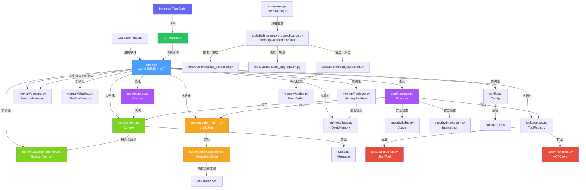

# SUMP 函数调用关系图

> 版本: v0.2.0 | 更新: 2026-08-23

---

## 总览：主对话链路

```
用户输入
  │
  ▼
Agent.run_stream(user_input)         ← 唯一入口（CLI/API 共用）
  ├─ Context.add_user_message()      ← 记录用户消息（自动持久化到 SQLite）
  ├─ Planner.plan(tools, rounds)     ← 分析上下文，生成执行计划（Plan）
  └─ Executor.execute(plan)          ← 按计划调度执行，流式产出事件
       └─ for round in range(plan.max_rounds):
            ├─ LLMClient.chat_full(history, tools=schemas)
            │    └─ DeepSeekClient.chat() → DeepSeek API（指数退避重试）
            ├─ if tool_calls:
            │    ├─ yield {"type":"tool_call", ...}
            │    ├─ Judge.analyze()           ← 规则匹配（毫秒级）
            │    ├─ Judge.analyze_llm()       ← LLM Flash 深度分析
            │    ├─ yield {"type":"security_check", ...}
            │    ├─ Interceptor.check()       ← 终裁，产出 SecurityEvent
            │    ├─ CLI: 同步审批 → 执行/拒绝
            │    └─ API: 挂起 pending → yield call_id → 等前端审批
            │         └─ Agent.approve_command() → 执行 → 替换结果
            └─ else:
                 └─ Executor._stream_final()
                      └─ yield {"type":"reasoning"|"content", ...}

__continue__ 流程（审批后自动延续）:
  POST /api/chat/{id} {"message":"__continue__"}
    └─ Agent.run_core() → Planner.plan() → Executor.execute()

CLI (examples/basic_chat.py):  消费事件 → ANSI 终端渲染
API (src/api/routes.py):       消费事件 → SSE 序列化
```

## 模块间调用关系



## 前端架构 (TypeScript)

```
Vite + TypeScript SPA (src/frontend/)
  ├─ index.html                     ← 入口（AI-Native UI / 浅色主题）
  ├─ src/api.ts                     ← REST + SSE 客户端
  │    ├─ Session CRUD              ← /api/sessions/*
  │    └─ streamChat()              ← SSE 流式解析
  ├─ src/renderer.ts                ← Markdown 渲染 + 消息构建（独立模块）
  │    ├─ renderMarkdown()          ← marked + highlight.js
  │    ├─ buildUserBubble()         ← 用户消息气泡
  │    ├─ buildAssistantContainer() ← 助手消息容器
  │    ├─ buildToolCall()           ← 工具调用展示
  │    ├─ buildToolResult()         ← 工具结果终端风格
  │    ├─ buildThinkingIndicator()  ← 深度思考指示条
  │    └─ buildSecurityInfo()       ← 安全审批卡片
  ├─ src/main.ts                    ← 主逻辑（会话管理/设置面板/流式聊天/事件路由）
  └─ src/style.css                  ← 设计系统（DeepSeek 风格 / 居中布局 / 悬浮输入框）
```

### SSE 事件类型（前端消费）

| type | 前端展示 |
|------|----------|
| `tool_call` | 调用工具 name {args}（淡紫背景圆角框） |
| `tool_result` | 暗色终端风格（#1E1E1E 黑底等宽字体） |
| `security_check` | 安全审查指示 / 审批弹窗（safe=🟢 命令确认, risky=🔴 危险确认） |
| `security_check_detail` | 内嵌 security-info 卡片（命令/危险等级/作用 格式化） |
| `session_name` | 侧边栏 + 标题栏会话名更新 |
| `reasoning` | 深度思考指示条（可展开，自动追踪 + 暂停指示点） |
| `content` | Markdown 渲染 + 语法高亮 |
| `continue` | 审批完成继续对话指示 |
| `error` | 红色错误提示 |
| `[DONE]` | 流结束 |

## 逐文件详解

### 1. `agent.py` — Agent（编排层，195 行）

> 不再内联核心循环。委托 Planner 生成计划，委托 Executor 调度执行。

| 方法 | 调用 | 被谁调用 |
|------|------|----------|
| `__init__(config?)` | Config → Context → LLMClient → ToolRegistry → SessionMemory → Planner → Executor → `_load_session()` | 外部实例化 |
| `run_stream(user_input)` | `ctx.add_user_message()` → `planner.plan()` → `executor.execute(plan)` → yield event | CLI / API |
| `run_core()` | `planner.plan()` → `executor.execute(plan)` → yield event | API `__continue__` |
| `approve_command(id, approved)` | `_pending_approvals` → 执行/拒绝 → 替换上下文 | API `/tools/approve` |
| `switch_session(id)` | `ctx.messages.clear()` → `_load_session()` | API 路由 |
| `new_session()` | `uuid4().hex` → `switch_session()` | API 路由 |
| `_cli_security_check()` | 调用 `on_security_check` 回调；API 模式返回 `None` 触发挂起 | Executor |
| `_api_approval_pending()` | 写入 `_pending_approvals` 队列 | Executor |

---

### 2. `core/planner.py` — Planner（计划层）

> 分析上下文生成 `Plan` 数据类。根据工具可用数量决定 `tools_enabled`。后续可接入 LLM 做复杂多步任务拆解。

| 方法 | 调用 | 被谁调用 |
|------|------|----------|
| `plan(tools_available, max_rounds)` | 纯逻辑 → 返回 `Plan(action, tools_enabled, max_rounds)` | Agent |

---

### 3. `core/executor.py` — Executor（执行层）

> 按 Plan 调度：工具调用循环 + 安全审查（Judge + Interceptor）+ 流式输出。
> 安全回调三态返回值：`None`=API 挂起 / `True`=放行 / `False`=拒绝。

| 方法 | 调用 | 被谁调用 |
|------|------|----------|
| `execute(plan)` | 无工具 → `_stream_final()`；有工具 → chat_full + `_process_tools()` | Agent |
| `_process_tools(tool_calls)` | Judge.analyze() → Judge.analyze_llm() → Interceptor.check() → 三态安全回调 → 执行/挂起/拒绝 | execute |
| `_analyze_security(command)` | 规则匹配 → LLM Flash 分析 → Interceptor 终裁 | _process_tools |
| `_stream_final()` | `llm.chat_stream()` → yield reasoning/content chunk → 写入上下文 | execute |

---

### 4. `config.py` — Config

| 方法 | 调用 | 被谁调用 |
|------|------|----------|
| `__init__()` | `os.getenv()` → `_load()` | Agent, LLMClient, DeepSeekClient |
| `_load()` | `yaml.safe_load()` → `_deep_merge()` | `__init__` |
| `_deep_merge()` | 递归自身 | `_load` |
| `get(key, default)` | 纯字典遍历 | 各模块 |

> 配置项包括：`agent.max_rounds`（10）、`agent.context_window`（50）、`deepseek.max_retries`（3）、`deepseek.retry_delay`（1.0s）。

---

### 5. `core/context.py` — Context

| 方法 | 调用 | 被谁调用 |
|------|------|----------|
| `add_user_message()` | `Message(role="user")` → `_append()` → 触发 `on_message` 持久化回调 | Agent.run_stream |
| `add_tool_message()` | `Message(role="tool")` → `_append()` | Executor |
| `history` (property) | `messages[-N:]` 切片，N 来自 `agent.context_window` | Executor |

---

### 6. `core/models/` — LLM 客户端

| 类 | 方法 | 说明 |
|----|------|------|
| `LLMClient` | `chat_full(messages, tools?)` | 统一入口，委托 DeepSeekClient |
| `LLMClient` | `chat_stream(messages)` | 流式输出，委托 DeepSeekClient |
| `DeepSeekClient` | `chat()` | 非流式调用，带指数退避重试 |
| `DeepSeekClient` | `chat_stream()` | 流式调用，带指数退避重试 |
| `DeepSeekClient` | `_retry_call()` | 自动识别可重试错误（限流/服务端错误/超时/连接） |
| `DeepSeekClient` | `_build_kwargs()` | 统一构建 thinking mode / reasoning_effort / temperature 参数 |

---

### 7. 记忆系统（memory/）

| 类 | 状态 | 核心方法 |
|----|------|----------|
| `MemoryProvider` (ABC) | ✅ | `store / retrieve / forget / clear` |
| `WorkingMemory` | ✅ | 任务便签（目标 + 过程记录，内存/SQLite 双后端 + 字节上限） |
| `SessionMemory` | ✅ | SQLite（save / load / load_all / list / delete / count / delete_oldest / upsert_session_name / update_tool_message） |
| `ShallowMemory` | ✅ | SQLite 分类条目 + priority 打分 + 过期回收（80% 阈值） |
| `DeepMemory` | ✅ | SQLite + priority + FTS5 BM25 + 向量余弦 RRF 混合检索 + 过期回收 |
| `SceneMemory` | ✅ | L2 场景层（name + summary，按 priority 排序，过期回收） |
| `ArchiveMemory` | ✅ | 历史会话归档副本（智能体不可见） |
| `Embedder` | ✅ | 本地 embedding（fastembed + bge-small-zh，单例加载） |
| `PersonaManager` | ✅ | SOUL.md / AGENTS.md 注入 system prompt + 睡眠精简（.bak 备份） |
| `MemoryRetriever` | ✅ | 深层/浅层召回 + 条数/字符/超时三重上限 |
| `DeepDedup` | ✅ | store / update / merge / skip 冲突检测 |
| `TaskMemory` | ✅ | 会话级 + scratchpad 便签 |
| `MemoryCompressor` | ⚠️ | 会话记忆压缩（flash 评估待实现） |

> 睡眠巩固链路（SleepManager 深睡触发）：
>
> ```
> SleepManager._run_consolidation()
>   └─ MemoryConsolidationTool.execute()
>        ├─ 每个会话：ShallowExtractionTool（OR 三判断 + priority 剪枝）
>        ├─ ArchiveMemory 归档 + SessionMemory 清除
>        ├─ SceneAggregationTool（浅层 → L2 场景块）
>        ├─ DeepExtractionTool（AND 三判断 + priority + DeepDedup 四动作）
>        ├─ ShallowMemory / DeepMemory / SceneMemory delete_expired（80% 阈值）
>        └─ PersonaManager.compact（灵魂文件精简）
>
> 召回注入链路（每次对话）：
> Agent._inject_context() → MemoryRetriever.recall()
>   → DeepMemory.search（BM25 + 向量 + RRF）→ system prompt
> ```

---

### 8. 工具系统（tools/）

| 类 | 状态 | 说明 |
|----|------|------|
| `Tool` (ABC) | ✅ | `execute()`, `to_openai_schema()` |
| `ToolRegistry` | ✅ | 注册/获取/列出/schema 导出 |
| `ShellTool` | ✅ | `subprocess` 执行，GBK 编码适配，30s 超时 |
| `MCPClient` | ✅ | 完整 MCP 协议：JSON-RPC 2.0 + stdio + 多服务器管理 + 工具发现 |
| `DateTimeTool` | ⚠️ | 桩 |
| `FileTool` | ⚠️ | 桩 |
| `SearchTool` | ⚠️ | 桩 |
| `WebTool` | ⚠️ | 桩 |
| `Sandbox` | ⚠️ | MCP 沙箱（桩） |

---

### 9. 安全系统（security/）

| 类 | 状态 | 说明 |
|----|------|------|
| `Judge` | ✅ | 规则匹配 + LLM Flash 双重分析，产出 Verdict |
| `Interceptor` | ✅ | 依据 Verdict 终裁，产出 SecurityEvent 推送前端 |
| `Scanner` | ⚠️ | 内容安全扫描（桩） |
| `rules/blacklist.yaml` | ✅ | 高危命令黑名单（rm/del/format/shutdown 等） |
| `rules/whitelist.yaml` | ✅ | 安全命令白名单（dir/ls/echo/type 等） |

> 审批流：Judge.analyze()（规则秒出）→ Judge.analyze_llm()（LLM Flash）→ Interceptor.check() 终裁 → SecurityEvent 推送前端。
> 安全回调三态：`None`=API 挂起 / `True`=放行 / `False`=拒绝。

---

### 10. 技能系统（skills/）

| 类 | 状态 | 说明 |
|----|------|------|
| `Skill` (ABC) | ✅ | `execute()`, `to_prompt()` |
| `SkillManager` | ✅ | 注册/获取/列出/卸载 |
| `SkillCreator` | ⚠️ | 从任务自动提炼技能（桩） |

---

### 11. 评估系统（evaluation/）

| 类 | 状态 | 说明 |
|----|------|------|
| `InternalEvaluator` | ⚠️ | 内部自评（桩） |
| `ExternalFeedback` | ⚠️ | 外部反馈收集（桩） |
| `Arbiter` | ⚠️ | 综合裁决（桩） |

---

### 12. 插件 / 调试系统

| 类 | 状态 | 说明 |
|----|------|------|
| `HookSystem` | ✅ | `on()`, `emit()` 事件钩子 |
| `SUMPAPI` | ✅ | `subscribe()`, `publish()` 事件流 |
| `LoggerPlugin` | ✅ | 内置日志记录插件 |
| `setup_logger()` | ✅ | 分级日志初始化 |
| `Tracer` | ⚠️ | span 记录（桩） |
| `KeyOutput` | ⚠️ | 关键输出格式化（桩） |

---

## 图例

| 标记 | 含义 |
|------|------|
| ✅ | 已实现 |
| ⚠️ | 接口就绪，核心逻辑待填充 |
| ❌ | 空文件/未开始 |
